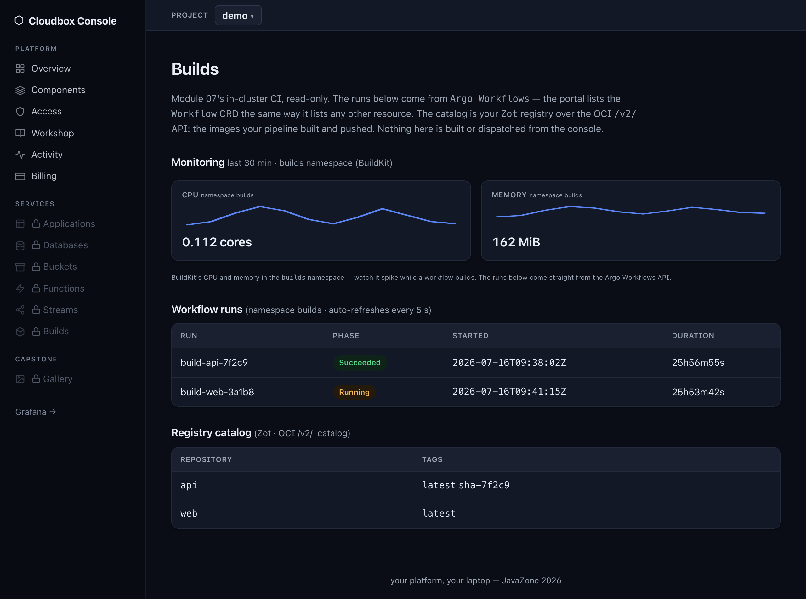
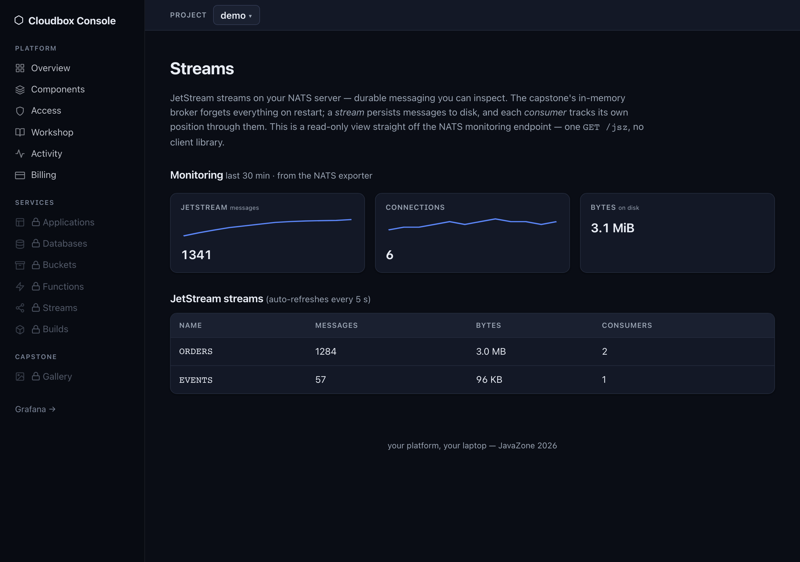
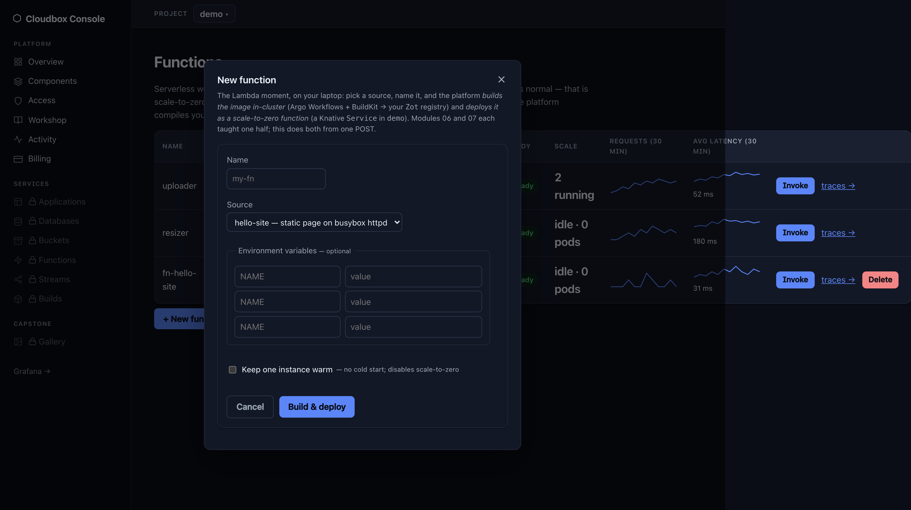

# Module 08 (stretch) — The Cloudbox Console: a portal you can actually read

## The goal

At the end of this module your platform has a front door: the **Cloudbox Console** at
http://localhost:30600, showing — live — the ArgoCD apps, Postgres clusters, and Knative
services *you built today*. The trophy: you create a database through its "New database"
form and prove with `kubectl` that a real `WorkshopDatabase` XR and a real CNPG cluster
appeared. Then you read the portal's entire source code, because it's small enough that
you can.

  

*This is what you're building: the Cloudbox Console — Go + htmx, server-rendered, digest-pinned, with per-component metrics/logs/traces from your OTel stack. Light + dark themes.*

It isn't just component health, either — every capability you stood up gets its own
page with a live **Monitoring** panel fed by the same OTel stack:

  
  
  

*Builds (BuildKit's resource use above the live Argo Workflows runs), Streams
(JetStream, via a prometheus-nats-exporter sidecar), and Buckets (RustFS — no Prometheus
endpoint, so the generic per-namespace pod signal). Each queries VictoriaMetrics only on
page load and degrades to "no data yet" when observability is off.*

## Why this matters

Everything you built so far is APIs and YAML — perfect for platform engineers, invisible
to everyone else. A portal is how a platform gets *adopted*: one place that answers "what
exists?" and "how do I get one?". The industry reflex is "portal = Backstage", and
sometimes that's right (we'll be honest about when, below). But a portal is not magic:
this one is a plain Go web server — a few thousand lines of Go and htmx, no framework, no
React build, no CDN — that reads the Kubernetes API with a ServiceAccount token. The entire
source is in this repo under [`apps/portal/`](../../apps/portal/) —
after today you can read every line of your platform's front door. Try saying that about
most portals.

## The task

1. Enable `portal.yaml` from the catalog. It lands in ns `portal` and takes seconds — it's
   one small Go binary (compare that to what module 08 used to be…).
2. Open **http://localhost:30600** and explore. The nav groups the pages into **Platform**
   (Overview, Components, Access, Workshop, Activity, Billing), **Services** (Applications,
   Databases, Buckets, Functions, Streams, Builds — Applications, Databases and Functions
   each have a detail page, and Buckets uses an in-page object browser), and **Capstone** (Gallery) — and none of them is a mock: every row is a live read
   from your cluster (the Workshop page even tracks your module progress, live). For each
   page, answer: *which Kubernetes API is this?* (You installed all of them today.)
3. **Hand your portal the keys.** The console can *read* everything, but creating
   databases needs a write grant it deliberately doesn't ship with: grant your portal
   access to the self-service API — copy [`portal-access.yaml`](portal-access.yaml)
   (in this lab directory) to `gitops/components/demo/` in your Gitea clone and push.
   Read it first: one Role (create/get/list/patch/update/delete `workshopdatabases` in ns
   `demo` — patch/update are what power the Resize action) and one RoleBinding to the
   portal's ServiceAccount. The platform owner grants access —
   the portal can't grant itself anything.
4. **The star task.** On the Databases page, use the **New database** form: name it
   `console-db`, size `small`. Then prove it's real, the module-04 way:
   - `kubectl -n demo get workshopdatabase console-db` — the XR the form created
   - `kubectl -n demo get cluster console-db-pg -w` — the composed CNPG cluster booting

   This is *exactly* the self-service loop you built in module 04 — same XRD, same
   Composition, same controllers — with a form in front of it. The portal didn't gain any
   new powers; your platform already had the API (and you just granted the portal the
   right to use it). That's the lesson.
5. Spot the difference: your module-04 database went through git; this one didn't. Find
   the evidence (`kubectl -n demo get workshopdatabase console-db -o yaml` — who created
   it? Is it in your Gitea repo?). Keep that thought for the explain-back.
6. Run `./verify.sh`.

## How it works (read the source!)

The whole portal is a few dozen small Go files (roughly one per page) and a set of HTML
templates in [`apps/portal/`](../../apps/portal/) — the `internal/kube/` package reads the
cluster, `internal/web/` renders the pages. The ones worth opening first:

- **`internal/kube/client.go`** — talks to the Kubernetes API from inside the pod: the
  ServiceAccount token mounted at `/var/run/secrets/kubernetes.io/serviceaccount/` is all
  the auth it has. Check what it's *allowed* to do: `kubectl describe clusterrole
  portal-read` — read-only on the surfaces it renders (ArgoCD apps, CNPG clusters, ksvcs,
  pods/nodes/events, workloads), not read-all, plus the one namespaced Role in `demo` for
  `workshopdatabases` that *you* granted in step 3. No admin token, no magic.
- **`internal/kube/resources.go`** — the "platform model": list ArgoCD `Applications`, CNPG
  `Clusters`, Knative `Services` as dynamic/unstructured resources.
- **`internal/web/components.go`** — the Components status page: your platform's own status
  page, built from Deployment/StatefulSet/DaemonSet readiness per component.
- **`internal/web/workshop.go`** — the Workshop page: live module progress inferred from
  cluster state, one simple rule per module. A hint, not a judge — each lab's `verify.sh`
  stays the authoritative check.
- **`internal/web/databases.go`** — the "New database" form POST builds a `WorkshopDatabase`
  object and creates it via the API — 20 lines that replace a whole portal product's
  scaffolder, because module 04 already did the hard part.
- **`internal/store/s3.go`** + the Gallery page — S3 reads against RustFS (this page comes
  alive in module 09).
- **htmx** (one vendored `.js` file, no build step) makes the forms and refreshes work.

## Build vs. buy: when you'd reach for Backstage instead

Be honest with yourself at work — bespoke won here because the platform is small and the
audience is you. Backstage earns its weight when you need:

- **The plugin ecosystem** — hundreds of integrations (ArgoCD, PagerDuty, Sonar, cost
  insights…) you'd otherwise write and *maintain* yourself.
- **A catalog at org scale** — hundreds of services, real ownership metadata,
  discoverability across dozens of teams; our console lists everything because
  everything fits on one screen.
- **TechDocs & scaffolder templates** — docs-as-code and golden-path templates with an
  ecosystem behind them.

The costs are real too: ~2 GB of Node.js + Postgres, YAML-heavy configuration, and
typically a team that owns it. A portal is a *product decision*, not a default.

> **Presenter demo (~5 min):** the presenter now enables `backstage.yaml` from the
> catalog on the projector cluster and runs the classic loop: catalog → software template
> → new Gitea repo → ArgoCD app → pods. Watch for what the template wires together —
> that integration glue is the real work of running Backstage.
>
> *Presenter notes:* pre-enable `backstage.yaml` before the module (first boot is slow,
> ~2 GB image + CNPG database — it's why this is a demo, not the lab). Show: guest
> sign-in at :30700, catalog entities fed from Gitea, run the template, then chase it
> through Gitea (:30300) and ArgoCD (:30080). `backstage.yaml` stays in the catalog —
> attendees with RAM to spare can run the same loop at home.

## Hints

## Check your work

```bash
./verify.sh
```

It checks: the portal app is Synced/Healthy; the deployment is ready; the UI answers on
:30600; the `portal` ServiceAccount exists (that token is the portal's only credential);
and — once you've created it — that `console-db` is a real, Ready `WorkshopDatabase`
with a healthy CNPG cluster behind it.

## Explain-back

Tell your neighbor: your module-04 database went `git push → ArgoCD → Crossplane`; the
console's database went `form → Kubernetes API → Crossplane`, skipping git entirely.
What did you lose by skipping git? (Who can delete `console-db`, and would anything bring
it back?) When is a direct-to-API portal the right trade, and when must the form write to
git instead?

## Going deeper

  

*The **Functions** page: the whole function lifecycle in one place — list, **Invoke** (wakes one from zero), **Delete**, and a build-and-deploy form that ties modules 06 + 07 together.*

- **Deploy a function from the console (the Lambda moment).** The **Functions** page
  (in the **Services** nav section) ties modules 06 + 07 together: in the *New function* form,
  pick a source, name it, and the console submits an Argo `Workflow` that builds your image
  (BuildKit → Zot) *and* a Knative `Service` that runs it — one form, a scale-to-zero URL,
  no CLI. The page unlocks with `knative-serving`; building also needs `argo-workflows`, and
  the two creates need one more scoped grant (same "hand the portal its keys" pattern as step 3):
  ```bash
  cp "$WORKSHOP/lab/08-portal/portal-functions-access.yaml" gitops/components/demo/
  git add . && git commit -m "grant portal: create Workflows + Knative Services" && git push
  ```
  Build `hello-site`, watch it on **Builds**, and the `fn-hello-site` row turns Ready on the
  same **Functions** page once the image lands (~1 min). Hit **Invoke** to wake it from zero
  and see the response; **Delete** removes it. Until the grant is synced the create surfaces a
  friendly *forbidden* flash — the portal can't grant itself anything.
- **Deploy the golden path from the console.** The **Applications** page turns the module-04
  golden-path `Application` XR into a form: name, image, scale, env, and the database/bucket
  toggles — one POST composes a workload **plus** its Postgres database **plus** its S3 bucket,
  wired together. It unlocks once `application-xr` is enabled, and (same "hand the portal its
  keys" pattern) needs one scoped grant:
  ```bash
  cp "$WORKSHOP/lab/08-portal/portal-applications-access.yaml" gitops/components/demo/
  git add . && git commit -m "grant portal: create Applications" && git push
  ```
  Deploy `my-app`, watch it turn Ready, and open its `*.sslip.io` URL — the apex of the
  self-service arc, from a form.
- **Read _why_ something is broken (Diagnostics, DR-0005).** When an Application or Function
  isn't Ready, open its **detail page**: instead of a bare red dot, the console shows the
  cause a `kubectl describe` would — the failing conditions, the offending pods' container
  states (`ImagePullBackOff`, `CrashLoopBackOff`, `OOMKilled`…), and an opinionated
  next-step hint ("the image can't be pulled — check the tag; for a source-built app,
  Redeploy once the build has pushed"). The console reads the conditions *with* you. Break
  it on purpose — deploy at a tag that doesn't exist in Zot — and watch the detail page name
  the problem. (Lists are for triage; detail pages are for diagnosis.)
- **Ship your own code (the app-team golden path, PRD-0012).** In *New Application*, switch
  **Source → Build from a repo** and give an in-cluster Gitea repo (`/` + branch +
  path with a `Dockerfile`). A ready one is seeded for you: **`cloudbox/demo-app`** — a real
  Go service that uses its composed Postgres (a live visit counter) and S3 bucket, so the page
  proves the wiring rather than ignoring it. Its Dockerfile builds `FROM` a golang base in Zot,
  so seed that base once first (same move as module 07's busybox):
  `crane copy --insecure public.ecr.aws/docker/library/golang@sha256:56961d79ea8129efddcc0b8643fd8a5416b4e6228cfd477e3fd61deb2672c587 localhost:30500/library/golang:1.25-alpine`.
  The console runs the module-07 `build-and-push` Workflow (clone →
  BuildKit → Zot) **and** creates the Application at the built image — so `git push → build →
  deploy` is the app team's counterpart to the platform team's `git push → ArgoCD → converge`.
  It needs **both** grants (the functions/workflows one from step 3 *and* the applications one
  above); repos are restricted to the in-cluster Gitea (digest-pinned + no arbitrary-URL builds).
  Then close the loop: change the code, push again, and hit **Redeploy** on the app's **detail
  page** — it rebuilds the repo at a fresh image tag and rolls the running app forward (a mutable tag would
  leave it pinned to the old image). That's `push → build → deploy` end to end, in the console.
  The sibling source, **Start from a template**, is the zero-setup version of this same path:
  instead of pointing at an existing repo, the console creates a fresh `cloudbox/` repo in
  Gitea from the `demo-app` template, then builds and deploys it — the zero-to-running path.
- **Create projects from the console (grant via git; act via console).** The top-bar
  **Project** selector maps 1:1 to Kubernetes namespaces; "New project" provisions a
  namespace *and* binds the portal's tenant grant into it, so the databases/functions/apps
  you create there land in that project. This is the platform pattern in miniature: you hand
  the portal a **tightly scoped** project-creation grant via git (namespaces + rolebindings +
  `bind` on exactly `portal-tenant` — the RBAC escalation guard), and it does the
  console-direct create. It still can't grant itself anything broader.
  ```bash
  cp "$WORKSHOP/lab/08-portal/portal-projects-access.yaml" gitops/components/demo/
  git add . && git commit -m "grant portal: create projects (scoped)" && git push
  ```
  Then create `team-a` from the selector, switch to it, and provision a database — note it
  lands in the `team-a` namespace, not `demo`. (See [DR-0004](../../docs/prd/0004-console-write-model.md)
  for why project *creation* is console-direct rather than a git round-trip.)
- **Add a column.** Show each CNPG cluster's `instances` count on the Databases page
  (`resources.go` + `databases.html` — it's one field and one ``).
- **Add a page.** The portal already has RBAC to list pods. A "Pods" page is ~30 lines
  by copying the Services page end to end.
- **Ship it like you mean it:** rebuild your changed portal *inside the cluster* with
  module 07's pipeline (BuildKit → Zot), point the Deployment at
  `zot.zot.svc.cluster.local:5000/...` via git, and watch ArgoCD roll it out. Your
  platform now builds and deploys its own front door.
- The take-home question: your platform has an API (module 04) *and* a portal. Which one
  is the product, and which one is the view? Argue both ways, then read
  `internal/web/databases.go` again and notice how little the portal actually does.

> Run the pinned manual verifier at `/opt/platform-engineering-workshop/lab/08-portal/verify.sh`. Layered hints and the solution are released separately by Intar.
