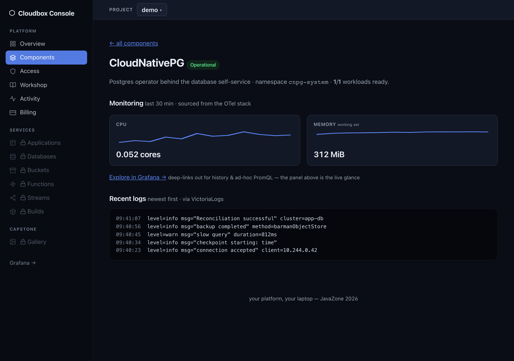

# Module 09 (capstone) — The picture pipeline: everything, wired together

## The goal

At the end of this module your platform runs an event-driven picture pipeline: you drop a
photo into the Cloudbox Console's Gallery, and a resizer service *that is not running*
wakes from zero, makes a thumbnail and a metadata file, and goes back to sleep. You prove
it three ways: pods appearing in a `-w` watch, the thumbnail landing in the gallery and
in S3, and — the flourish — the whole chain as a single trace in Grafana.

  

*Look at what you built: the Cloudbox Console surfaces per-component metrics and a live log tail straight from the OTel stack (VictoriaMetrics / VictoriaLogs / VictoriaTraces) — the same telemetry that renders your upload as one end-to-end trace in Grafana.*

**Prerequisites:** this capstone builds on modules 03 (RustFS), 06 (Knative Serving)
and 08 (the portal) — have them green, or jump straight here with
`./scripts/catch-up.sh 8`.

## Why this matters

This is the capstone because it uses *everything you built today*, at once: GitOps
delivers it (02), RustFS stores it (03), Knative scales it from zero (06), the portal
fronts it (08), and the observability stack you enable on-demand right here — the
Victoria stack + OTel Collector — watches it end to end. The one new piece is
**Knative Eventing**: a Broker and Triggers — the open-source shape of S3 events → SQS →
Lambda. The uploader doesn't know the resizer exists; it emits a fact
(`dev.cloudbox.image.uploaded`, as a CloudEvent) and the Broker routes it to whoever
subscribed. That decoupling is the whole point of event-driven architecture, and today it
runs on your laptop, readable end to end.

## The task

1. Enable **two** catalog apps: `knative-eventing.yaml` (the event mesh — Broker/Trigger
   machinery in ns `knative-eventing`) and `picture-pipeline.yaml` (ns `pipeline`: a
   Broker, two cluster-local Knative Services — `uploader`, `resizer` — a Trigger, and a
   Job that creates the `images` bucket). Wait until
   `kubectl -n pipeline get broker,trigger,ksvc` is all Ready — then note the pod count
   in ns `pipeline`: with no traffic, both ksvcs sit at **zero**.
2. **The moment.** Two terminals:
   - `kubectl -n pipeline get pods -w`
   - open **http://localhost:30600/gallery** and upload any JPEG/PNG.

   Watch the uploader pod cold-start to receive the file, then the *resizer* appear from
   nowhere to handle the event. Nothing called it. The first upload is the slow one: both
   services start from zero (image pull + boot), so the thumbnail can take up to ~a minute
   to land — the gallery shows "original uploaded, waiting for the resizer…" until it does.
   Count the actors between your browser and that second pod.
3. **Find the results.** Both views of the same bucket:
   - the Gallery (refresh) shows the thumbnail + its metadata (dimensions, dominant color);
   - raw S3: `originals/`, `thumbs/`, and `meta/.json` under bucket `images`
     (`aws s3 ls` against :30900 — module 03 muscle memory; hint 3 has the exact lines).
4. **Inspect the plumbing.** `kubectl -n pipeline get broker,trigger` — find what the
   Trigger filters on. Then read the resizer's logs and find the `ce-type`, `ce-source`,
   `ce-id` headers: a CloudEvent is just an HTTP POST with five headers. Where did your
   image bytes go, and what actually traveled through the Broker?
5. **The flourish.** Observability is an on-demand capability — enable the Victoria stack +
   OTel Collector from the catalog first (hint 5 has the files), then find the upload's trace
   in Grafana at **http://localhost:30030** → Explore → **VictoriaTraces** and see the chain —
   portal → uploader → broker → resizer — as one waterfall. Hint 5 if the Jaeger trace view is
   new to you.
6. Run `./verify.sh`.

## Hints

## Check your work

```bash
./verify.sh
```

It checks: both apps Healthy (Synced is the happy path; sync is advisory); the eventing control plane and Broker data plane
are up; Broker `default` and Trigger `resize-on-upload` are Ready; both ksvcs are Ready;
bucket `images` exists; and — if anything has been uploaded — that every batch of
originals has produced at least one matching thumbnail. The upload itself needs a human
(or `solve.sh`): the machinery is verifiable, the *moment* is yours.

## Explain-back

Tell your neighbor: why does the uploader POST an event to a Broker instead of just
calling the resizer's URL — what breaks, and what becomes possible, under each design?
(Think: adding a third consumer; deploying a broken resizer.) And when the resizer is
down, *where exactly* does the event wait — and what would take that waiting event to
production grade?

## Going deeper

- **Second consumer, zero coupling.** Add another Trigger on the same
  `dev.cloudbox.image.uploaded` type pointing at a new ksvc (start from module 06's
  `hello` — its logs will show the CloudEvent POSTs). Note what you did *not* have to
  change: the uploader.
- **Policy at the edge.** Make the uploader reject files over 5 MB with a `413`
  (`apps/uploader/main.go` — it's a few lines around the multipart read), rebuild with
  module 07's in-cluster pipeline, roll it out via git.
- **Sepia.** Fork `apps/resizer` into a sepia-filter service writing `sepia/`,
  subscribe it with its own Trigger — a second opinion on every upload, built entirely
  from parts you own.
- You built S3-events → queue → function on a laptop. Sketch which managed products
  this replaces on your cloud bill, and what you'd genuinely still pay for.

> Run the pinned manual verifier at `/opt/platform-engineering-workshop/lab/09-capstone/verify.sh`. Layered hints and the solution are released separately by Intar.
