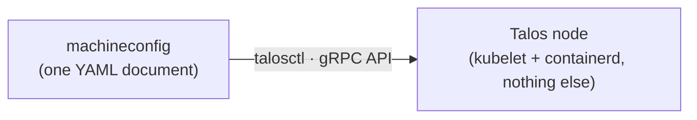

# An OS with nothing to hack on

- Talos Linux: immutable, API-only, Kubernetes-only
- No shell. No SSH. No package manager
- One config document, managed over gRPC
- Cilium replaces CNI **and** kube-proxy with eBPF

 **Cloud parallel:** EKS · AKS · GKE hand you a cluster and hide this layer — today you own the OS and the network underneath it.
