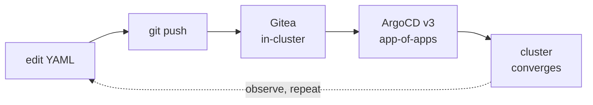

# The loop you'll use all day

- Git is the **only** way anything changes
- Your git server runs **inside** the cluster

 **Cloud parallel:** no product to buy — where a hyperscaler gives you a console + CLI, GitOps makes git the single control plane (the same Argo/Flux that runs on managed clusters).
