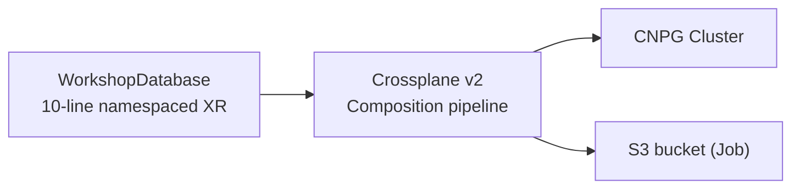

# One resource in, a stack out

```mermaid
flowchart LR
  xr["WorkshopDatabase
10-line namespaced XR"] --> comp["Crossplane v2
Composition pipeline"]
  comp --> pg["CNPG Cluster"]
  comp --> bucket["S3 bucket (Job)"]
```

- You own **both** sides of the API
- `aws rds create-db-instance` — but yours
