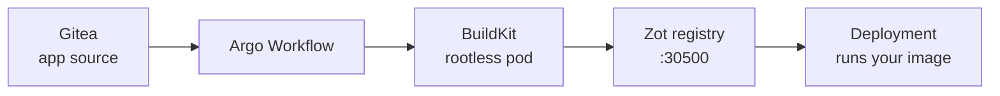

# Your registry, your builds

- CI is just pods with filesystem tricks
- Git → build → push → deploy: all in-cluster

 **Cloud parallel:** CodeBuild + ECR · Cloud Build + Artifact Registry — the whole build-and-ship pipeline, running inside your own cluster with zero external services.
