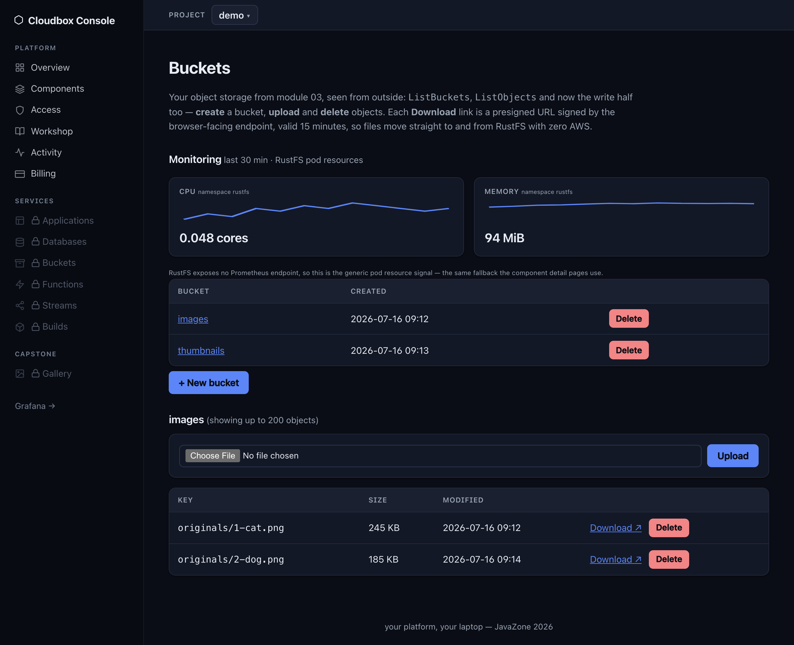

# One console, every capability

  
  
  

Builds · Streams · Buckets — each with a live **Monitoring** panel off the same OTel stack. NATS gets a prometheus-nats-exporter sidecar; RustFS has no metrics endpoint, so it falls back to the generic per-namespace pod signal — honestly labelled.
