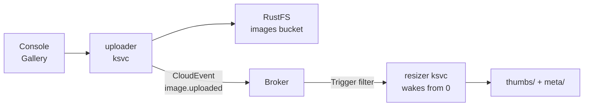

# One upload, five actors, zero coupling

```mermaid
flowchart LR
  gallery["Console
Gallery"] --> uploader["uploader
ksvc"]
  uploader --> s3["RustFS
images bucket"]
  uploader -->|"CloudEvent
image.uploaded"| broker["Broker"]
  broker -->|"Trigger filter"| resizer["resizer ksvc
wakes from 0"]
  resizer --> s3b["thumbs/ + meta/"]
```

- Uploader doesn't know the resizer exists
- It emits a **fact**; the Broker routes it
