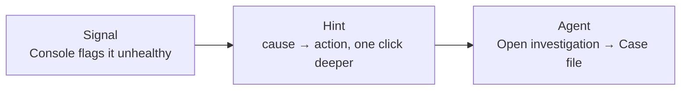

# The escalation ladder: signal → hint → agent

- Most incidents die at step 1 or 2 — that's the design working
- Escalate only when the hint isn't enough
- Step 3 is always one click away, never forced
